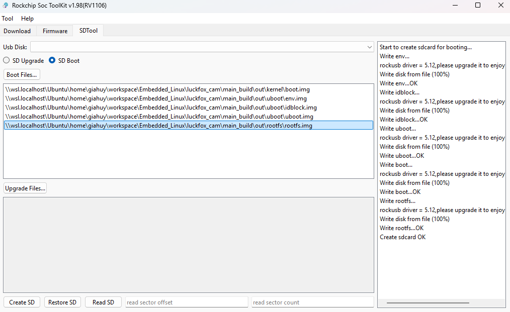
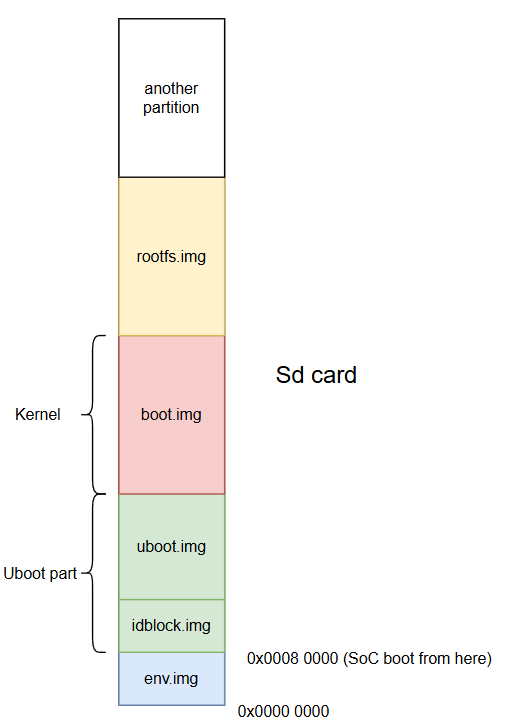

Structure of main_build project is going to be like this:

```sh
.
├── README                  # Descriptor
├── build.sh                # Build script
├── configs                 # Copy folder contains linked config files
│   ├── busybox_configs 
│   ├── kernel_configs
│   ├── kernel_dts
│   ├── uboot_configs
│   └── uboot_dts       
├── busybox-1.27.2          # Busybox folder to build rootfs
|── kernel                  # Rockchip linux kernel folder
├── out                     # Output folder
│   ├── kernel                  # Kernel compiled image
│   ├── rootfs                  # Rootfs compiled image
│   └── uboot                   # Uboot compiled image
├── toolchain               # Toolchain folder contains cross compiler
│   └── arm-rockchip830-linux-uclibcgnueabihf
├── tools                   # Set of tools, utility
│   ├── board
│   └── pc
└── uboot                   # Uboot folder
    ├── rkbin                   # Rockchip ultilities to pakage image
    └── u-boot                  # Uboot source code
```
## Uboot
```sh
# To build
cd main_build
./build.sh uboot
# To clean
./build.sh clean_uboot
```
## Kernel
```sh
# To build
cd main_build
./build.sh kernel
# To clean
./build.sh clean_kernel
```
After this step we got Linux running, if Kernel log message is shown till error message "Kernel panic", that mean all is good now, one more step is to mount the rootfs to the device, and then we can boot up the system properly.

## Rootfs minimal with BusyBox
```sh
# To build
cd main_build
./build.sh rootfs
# To clean
./build.sh clean_rootfs
```
Until now im building rootfs with only busybox. Everything is working fine but seem like init script does not get executed. A small success for now. Here is the result of minimal linux image running on Luckfox pico max RV1106:
```sh
/ # ls
etc         init        proc        dev         lost+found
sbin        usr         sys         bin
/ # echo Hello
Hello
/ #
```
I flash image with this tool in Window 11 OS




# My learning notes among errors and successes
Convention:
+ [``something``]: Consider something is optional.
+ <``something``>: Consider something is required.

## 1. Enviroment image, what is it??
Our output image from this SDK has ``env.img``. After a day looking at Makefile and build scripts related to enviroment build. I see a line that makes ``env.img`` by ``mkenvimage`` utility.

``mkenvimage`` make enviroment image from ``whatevername.txt`` file. ``whatevername.txt`` is the file that describes the environment, example here:
```text
root=/dev/mmcblk1p5
blkdevparts=mmcblk1:32K(env),512K@32K(idblock),256K(uboot),32M(boot),-(rootfs)
```

Then use ``mkenvimage`` as follows:
```sh
./tools/mkenvimage -s 0x4200 -o env.img whatevername.txt
```
``-s`` is the size of enviroment image, ``-o`` is the output file name.

So what does the env.img file mean anyway????

``env.img`` is an image or a file, it first is stored in flash rom, our case is sdcard. Then U-boot or kernel can manipulate it to get its contents. Take a look at ``whatevername.txt``, it says that rootfs will be at ``/dev/mmcblk1p5`` via option ``root``, and partition layout via ``blkdevparts`` option will be:
+ 32K for enviroment - start from 0x0
+ 512K for idblock(part of uboot image) - offset at 32K (Offset is 32k because offset from 0x0 to 32K is ``0x80000 - a typical address for bootloader). SoC will go to this address to run bootloader first.``
+ 256K for U-boot, 
+ 32M for boot
+ rest of the space for rootfs

The ``blkdevparts`` command line option adds support for reading the
block device partition table from the kernel command line.



## 2. Kernel Panic !!!!!!
The most common outcome is a kernel panic. The kernel will attempt to mount the root filesystem specified by the ``root=`` parameter. If it cannot find the specified device or if the device does not contain a valid filesystem, the kernel will panic and halt the boot process. Something like this will come to you:
```shell
[    0.215999] VFS: Cannot open root device "xxx" or unknown-block(xx,xx): error -6
[    0.216019] Please append a correct "root=" boot option; here are the available partitions:
```
To solve it, pass argument root to Uboot by adding this line in ``env.txt``
```
sys_bootargs=root=/dev/mmcblk1p5
```
/dev/mmcblk1p5 is where rootfs located. Kernel will panic if it can not find rootfs or rootfs is at wrong location.